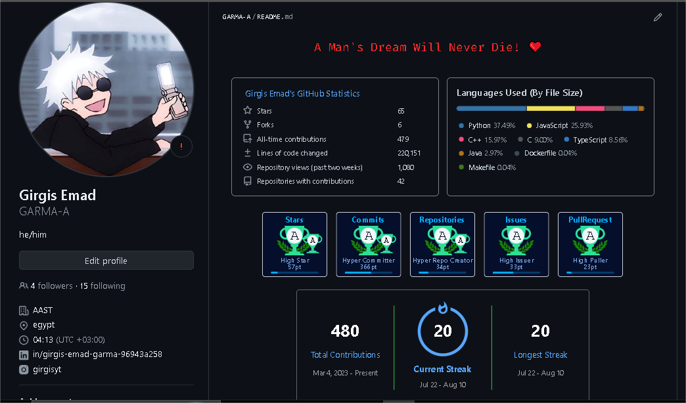

Git Commands
============

## Translated Versions
- [Versão em português](READMEpt.md)
- [Versión en español](READMEes.md)
- [Türkçe versiyon](READMEtr.md)
- [বাংলা সংস্করণ](READMEbn.md)
- [हिन्दी अनुवाद](READMEhi.md)
- [العربية](READMEar.md)

___

_A list of my commonly used Git commands_

*If you are interested in my Git aliases, have a look at my `.bash_profile`, found here: https://github.com/joshnh/bash_profile/blob/master/.bash_profile*

--

### Getting & Creating Projects

| Command | Description |
| ------- | ----------- |
| `git init` | Initialize a local Git repository |
| `git clone ssh://git@github.com/[username]/[repository-name].git` | Create a local copy of a remote repository |

### Basic Snapshotting

| Command | Description |
| ------- | ----------- |
| `git status` | Check status |
| `git add [file-name.txt]` | Add a file to the staging area |
| `git add -A` | Add all new and changed files to the staging area |
| `git commit -m "[commit message]"` | Commit changes |
| `git rm -r [file-name.txt]` | Remove a file (or folder) |

### Branching & Merging

| Command | Description |
| ------- | ----------- |
| `git branch` | List branches (the asterisk denotes the current branch) |
| `git branch -a` | List all branches (local and remote) |
| `git branch [branch name]` | Create a new branch |
| `git branch -d [branch name]` | Delete a branch |
| `git push origin --delete [branch name]` | Delete a remote branch |
| `git checkout -b [branch name]` | Create a new branch and switch to it |
| `git checkout -b [branch name] origin/[branch name]` | Clone a remote branch and switch to it |
| `git branch -m [old branch name] [new branch name]` | Rename a local branch |
| `git checkout [branch name]` | Switch to a branch |
| `git checkout -` | Switch to the branch last checked out |
| `git checkout -- [file-name.txt]` | Discard changes to a file |
| `git merge [branch name]` | Merge a branch into the active branch |
| `git merge [source branch] [target branch]` | Merge a branch into a target branch |
| `git stash` | Stash changes in a dirty working directory |
| `git stash clear` | Remove all stashed entries |

### Sharing & Updating Projects

| Command | Description |
| ------- | ----------- |
| `git push origin [branch name]` | Push a branch to your remote repository |
| `git push -u origin [branch name]` | Push changes to remote repository (and remember the branch) |
| `git push` | Push changes to remote repository (remembered branch) |
| `git push origin --delete [branch name]` | Delete a remote branch |
| `git pull` | Update local repository to the newest commit |
| `git pull origin [branch name]` | Pull changes from remote repository |
| `git remote add origin ssh://git@github.com/[username]/[repository-name].git` | Add a remote repository |
| `git remote set-url origin ssh://git@github.com/[username]/[repository-name].git` | Set a repository's origin branch to SSH |

### Inspection & Comparison

| Command | Description |
| ------- | ----------- |
| `git log` | View changes |
| `git log --summary` | View changes (detailed) |
| `git log --oneline` | View changes (briefly) |
| `git diff [source branch] [target branch]` | Preview changes before merging |


# **How To write a Message On GitHub**

# h1

## h2

### h3

#### h4

##### h5

###### h6

```yaml
# h1
## h2
### h3
#### h4
##### h5
###### h6
```

<hr/>

normall text **Bold Text** _italic Text_ **_Bold Italic Text_** ~~line throw~~

```yaml
noraml text  **Bold Text**  *italic Text*
***Bold Italic Text*** ~~line throw~~
```

## making a unorderd list

- first
- second
  - subitem1
  - subitem2
- third

```yaml
- first
- second
  - subitem1
  - subitem2
- third
```

## making ordered list

1. first
   1. sub1
   2. sub2
   3. sub2
2. second
3. third

```yaml
1. first
1. sub1
2. sub2
3. sub2
2. second
3. third
```

## CheckBoxes

- [ ] this is not complete yet
- [x] this is complete

```yaml
- [ ] this is not complete yet
- [x] this is complete
```

## Links

[Link to Google HomePage](https://google.com/)

```yaml
[Link to Google HomePage](https://google.com/)
```

## How to include Imgs



## The code for displaying the img

```

```

## If you want to resize the image


## You can use simple HTML code

```html

```

## Table

| column1 | column2 |
| :------ | ------: |
| row1 a  |  row1 b |
| row1 a  |  row1 b |
| row3 a  |  row3 b |
| row4 a  |  row4 b |

```yaml
| column1 | column2 |
|:---|---:|
|row1 a | row1 b
|row1 a | row1 b
|row3 a | row3 b
|row3 a | row3 b
```

### For Center Table Content

```yaml
| column1 | column2 |
|:---:|:---:|
|row1 a | row1 b
|row1 a | row1 b
|row3 a | row3 b
|row3 a | row3 b

```

### highlight some Text

this is the `console.table()` in javascript
show's the data like that

```yaml
┌─────────┬───────────┬─────┬─────────────────┐
│ (index) │   name    │ age │      city       │
├─────────┼───────────┼─────┼─────────────────┤
│    0    │  'Alice'  │ 25  │   'New York'    │
│    1    │   'Bob'   │ 30  │ 'San Francisco' │
│    2    │ 'Charlie' │ 35  │    'Chicago'    │
└─────────┴───────────┴─────┴─────────────────┘
```

### highlighted Text code

```yaml
`console.table()`
```

### Show differences you made in the code

```diff
- const data = [];
+ const data = {};
```

### the code

#### ```diff

#### - const data = [];

#### + const data = {};

#### ```

### Reply to specific message

#### **Ihave idea 1 that is lab lab laaaa....**

#### **also idea 2 that is lab lab laaaa....**

<hr/>

> Ihave idea 1 that is lab lab laaaa....

### i think i agree with this

> also idea 2 that is lab lab laaaa also....

### i dont agree with that
